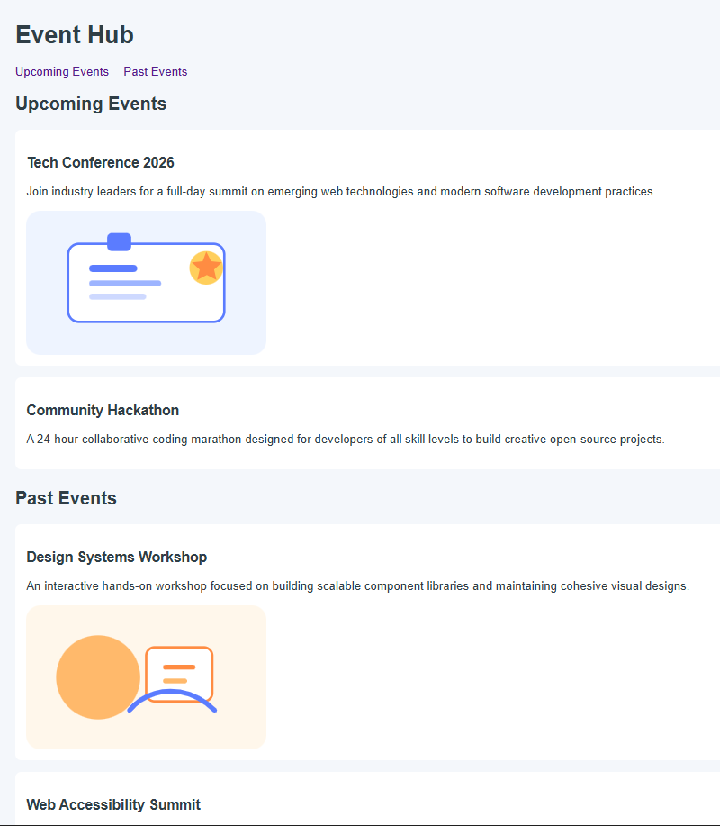

# Event Hub

A simple event listing page built with HTML and CSS. It showcases upcoming and past events using semantic article sections and includes local image assets.

## Features
- Upcoming events section
- Past events section
- Separate stylesheet for basic styling
- Local images stored in the images folder

## Files
- index.html - Main page structure
- styles.css - Basic page styling
- images/upcoming-event.svg - Illustration for an upcoming event
- images/past-event.svg - Illustration for a past event

